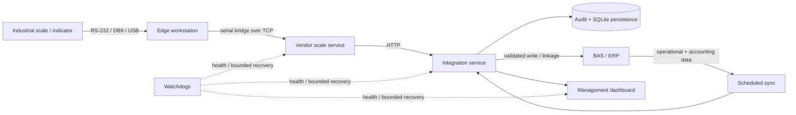

# Industrial Scale → BAS/ERP Integration

Scope:

- industrial weighing equipment;
- machine-originated weight capture;
- validation and unit normalization;
- BAS/ERP document linkage;
- audit records;
- management dashboard;
- scheduled synchronization;
- health checks and bounded recovery.

Customer identity, credentials, production network details, production data, production source code, and production configuration are excluded.

## Architecture

The weighing/write path is local. Dashboard access is separate from the physical transaction path.

## Hardware

Equipment used:

- VEST-250A12E
- VN-1500-4 + IE-04
- PROK/VP static 200 kg / 50 g
- KELI XK3118T1

Interfaces:

- RS-232 / DB9
- USB serial adapters
- TCP bridges
- vendor HTTP service

## Controls

- Failed reads do not reuse previous valid weights.
- Raw vendor values and normalized kilograms are stored separately.
- BAS/ERP writes require an identified document and row.
- Repeated requests use operation identity/idempotency rules.
- Missing BAS/ERP coverage is unavailable, not zero.
- Automatic recovery is limited to predefined infrastructure actions.
- Credentials, COM reassignment, licence changes, physical-device faults, and ambiguous data repair require manual handling.

## Dashboard

The dashboard reads synchronized BAS/ERP data.

Included views cover operational and accounting data used by the project.

The public access layer is path-scoped. The live URL and deployment credentials are excluded.

## Failure handling

Covered cases:

- vendor API timeout;
- malformed vendor response;
- wrong-scale response;
- stale measurement reuse;
- duplicate/retry handling;
- integration-service failure;
- vendor scale-service failure;
- public HTTPS route failure;
- stale BAS/ERP dashboard sync;
- Windows account password reset affecting scheduled jobs and DPAPI credentials;
- backup and integrity checks.

See [`docs/failure-modes.md`](docs/failure-modes.md).

## Verification status

At the documented checkpoint:

- TypeScript compilation: PASS;
- automated suite: 126 PASS / 0 FAIL;
- controlled public-route failure recovery: PASS;
- BAS/ERP dashboard sync recovery after credential rotation: PASS;
- external dashboard access after recovery: PASS.

Status labels used here:

- `TESTED`
- `IMPLEMENTED`
- `TBD`

See [`docs/reliability-tests.md`](docs/reliability-tests.md).

## Limits

Not established:

- zero downtime;
- enterprise high availability;
- maintenance-free operation;
- arbitrary scale-vendor compatibility;
- automatic physical-hardware repair;

## Files

- [`docs/architecture.md`](docs/architecture.md)
- [`docs/hardware-interfaces.md`](docs/hardware-interfaces.md)
- [`docs/failure-modes.md`](docs/failure-modes.md)
- [`docs/reliability-tests.md`](docs/reliability-tests.md)
- [`examples/sanitized-events.json`](examples/sanitized-events.json)
- [`examples/site-manifest.example.json`](examples/site-manifest.example.json)
