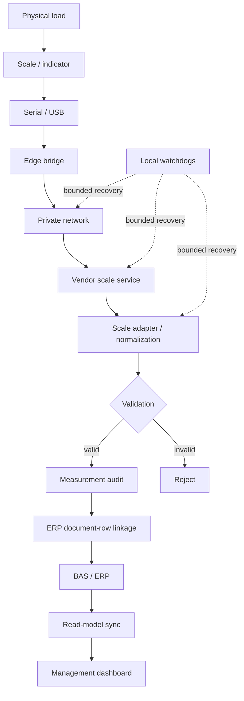

# Architecture

## Data path

## Device boundary

Accepted source: configured scale path.

Rejected conditions:

- unexpected device/path;
- vendor error;
- timeout;
- malformed response;
- stale value.

## Measurement record

Stored fields include:

- raw vendor value;
- raw unit;
- normalized kilograms;
- capture timestamp;
- logical scale identity.

## BAS/ERP boundary

A measurement does not select a BAS/ERP destination.

Required linkage:

- workflow;
- document;
- row;
- direction;
- operation identity.

Accounting and commercial data remain BAS/ERP-derived. Missing supplier, payment, cost, or historical coverage remains unavailable.

## Retry and write handling

BAS/ERP-affecting operations use stable operation identity/idempotency rules. Ambiguous retries do not create a second business write.

## Recovery boundary

Automatic actions:

- restart owned service;
- reapply predefined route;
- bounded retry;
- health recheck.

Manual actions:

- credential changes;
- licence changes;
- COM reassignment;
- physical-device repair;
- ambiguous data repair.

Health checks used by the deployment include HTTP probes, synthetic vendor-service probes, public HTTPS probes, sync-success age, and SQLite integrity checks.

## Network boundary

The weighing path does not require public dashboard availability.

## Identity

Logical scale IDs are separate from:

- COM ports;
- workstation names;
- IP addresses;
- transport details.

Example configuration: [`../examples/site-manifest.example.json`](../examples/site-manifest.example.json).

## Deployment components

- Windows Scheduled Tasks;
- PowerShell watchdogs;
- vendor serial/TCP bridge;
- vendor weighing service;
- external site configuration;
- SQLite;
- BAS/ERP extension/integration logic.

No fleet-control layer is included.
